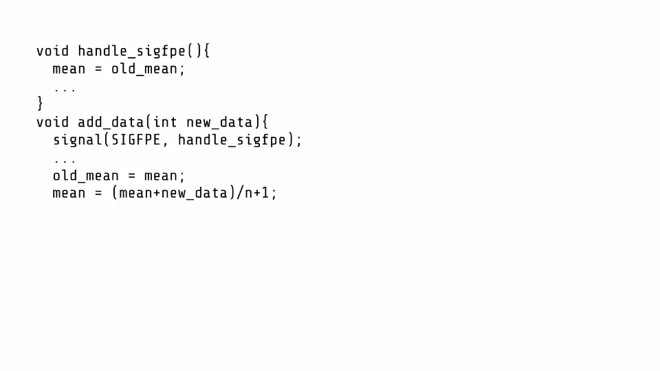

   

<h1 class='h1'>Heckler</h1>

Breaking Confidential VMs with Malicious Interrupts (to appear at <a href='https://www.usenix.org/conference/usenixsecurity24'>USENIX Security 2024</a>)

  

    

      <a class="btn btn-primary btn-cta rounded-pill btn-lg head-button" href="/heckler/heckler_usenix24.pdf" role="button">Paper</a>
    

  

    

      <a class="btn btn-primary btn-cta rounded-pill btn-lg head-button" href="https://github.com/ahoi-attacks" role="button">Source</a>
    

  

    

      <a class="btn btn-primary btn-cta rounded-pill btn-lg head-button" href="#cve" role="button">CVE</a>
    

 

## How Does It Work?  
AMD SEV-SNP and Intel TDX enable Confidential VMs (CVMs). With these CVMs, the
untrusted hypervisor is still responsible for resource and configuration
management. Consequently, the hypervisor also manages interrupts for CVMs. In
Heckler, the hypervisor uses malicious interrupts to compromise the security of
the CVMs. Our insight is to use the [interrupt handlers](/blog/ahoi-overview/)
that have [global effects](/blog/ahoi-overview/), such that we can manipulate a
CVM’s register states to change the data and control flow. Let’s first look at
how interrupts are handled during a benign execution. The hypervisor hooks on
physical interrupts from the interrupt controller and sends them to the CVMs.
The CVMs service these interrupts by executing handlers. In the x86
architecture, hardware exceptions (e.g., divide-by-zero, undefined instruction)
are also mapped to interrupt numbers. For a detailed explanation check out our
[blog post](/blog/ahoi-overview/).

### Int 0x80
In the x86 architecture, user-space applications execute legacy 32-bit system
calls using the `int 0x80` instruction. When the hardware executes this
instruction, it raises interrupt number 128 (0x80) which invokes the 32-bit
system call handler in the Linux kernel. This system call handler has a global
effect—it returns the result of the system call in `rax`. We use this global
effect in the handler to compromise the CVMs execution. Specifically, a
malicious hypervisor injects `int 0x80` to induce a change in the value of `rax`
that a victim application uses. For example, change `rax` right before an
application checks it to successfully authenticate a user. This allows the
malicious hypervisor to bypass authentication checks (e.g., OpenSSH, sudo).

<!--  -->

### Signals
The OS converts different hardware exceptions to signals that are delivered to
user-space applications. The applications register signal handlers which can
have [global effects](/blog/ahoi-overview). In AMD SEV-SNP, the hardware
exceptions are mapped to interrupt numbers that a malicious hypervisor can
inject. These malicious interrupts trick the OS into sending a signal to the
user-space application. Depending on the effects application’s signal handler,
this malicious interrupt injection can be used to compromise the security of the
CVM.

In the Animation below, the function updates the mean of a data set when new data is added to it. Crucially, in a signal handler, the application discards any faulty data (e.g., data that overflows the mean) and reverts the mean. An attacker can bias this data set by using Heckler.  

## Case Studies
### OpenSSH
Using Heckler, we attack OpenSSH `v9.4.P1+` to compromise its authentication and
get a shell on the CVM. Without Heckler, the attacker is not authorized to get a
shell.

Specifically, OpenSSH calls `mm_answer_authpassword` to decide if authentication
is successful. We use Heckler’s `int 0x80` attack and inject an interrupt when
this function executes to change its return value. To determine when to inject
the interrupt, we use the hypervisor’s ability to observe page faults.
`mm_answer_authpassword` invokes `auth_password` on a different page. We inject
`int 0x80` when we observe that execution returns back to the
`mm_answer_authpassword` to compromise its return value.

<iframe width="100%" height="515" style='margin-top: 2rem; margin-bottom: 2rem;' src="https://www.youtube.com/embed/pQCvn9S1Jbc?si=oCL6dyuV6KqqCan9&rel=0" title="YouTube video player" frameborder="0" allow="accelerometer; autoplay; clipboard-write; encrypted-media; gyroscope; picture-in-picture; web-share" referrerpolicy="strict-origin-when-cross-origin" allowfullscreen></iframe>

### Sudo

We demonstrate an attack on the sudo binary in the Ubuntu 23.10 distribution to get a root shell on the CVM. Specifically, an attacker with a non-root shell on the CVM can escalate privilege to a root shell using Heckler. 

Like the OpenSSH attack, we identify functions that lie on different pages. We observe the page trace in the hypervisor and use int 0x80 to compromise the return values leading to successful authentication. 

<iframe width="100%" height="515" style='margin-top: 2rem; margin-bottom: 2rem;'
src="https://www.youtube.com/embed/Q9TEmhh6ufE?si=HSzBchc2gs8nv96B"
title="YouTube video player" frameborder="0" allow="accelerometer; autoplay;
clipboard-write; encrypted-media; gyroscope; picture-in-picture; web-share"
referrerpolicy="strict-origin-when-cross-origin" allowfullscreen></iframe>

In summary, a malicious hypervisor can use Heckler to gain access to a shell (using the OpenSSH attack) on the CVM and escalate privilege to a root shell (using the sudo attack). Further, Heckler can be used to compromise victim applications by sending arbitrary signals. For more details, please see our [paper](/heckler/heckler_usenix24.pdf) and our [code](https://github.com/ahoi-attacks). 

## Affected Hardware and Software

All Intel TDX and AMD SEV-SNP processors are vulnerable to Heckler. There are
for both of them. See our FAQs for more information.

## FAQ


- While we haven’t tested this, in theory, yes all older versions of SEV are
vulnerable to Heckler.





- No. `int 0x80` is used to invoke legacy 32-bit system calls. This instruction
is also valid in 64-bit binaries. Furthermore, Heckler does not require the
application to explicitly execute the `int 0x80` instruction. Therefore, all
application binaries are vulnerable to Heckler if they execute with a Linux
kernel that registers a vulnerable `int 0x80` handler.





- No. Heckler assumes a malicious hypervisor to inject interrupts. For normal
cloud VMs, the hypervisor is implicitly trusted and will not attack the VMs.
Also, co-tenant VMs cannot use Heckler because the hypervisor detects and
filters any malicious interrupt injections from other VMs.




- Heckler is tracked under 2 CVEs: (see [CVE section](#cve)).
- For Intel TDX, there are [patches](https://git.kernel.org/pub/scm/linux/kernel/git/torvalds/linux.git/commit/?id=f4116bfc44621882556bbf70f5284fbf429a5cf6) to the Linux kernel that check if `int 0x80` is externally injected. TDX is not vulnerable to the attack from signals as the hardware blocks external injection of interrupts between 0-30. 

- For AMD SEV-SNP, [turn off x86 emulation in the Linux
  kernel](https://git.kernel.org/pub/scm/linux/kernel/git/torvalds/linux.git/commit/?id=b82a8dbd3d2f4563156f7150c6f2ecab6e960b30)
  which will prevent Heckler from using the effects of the `int 0x80` handler.
  Currently, there is no fix to protect against Heckler’s signal attacks. For
  robust defense, we recommend that cloud users switch to protected interrupt
  delivery available on AMD SEV-SNP. Unfortunately, as of 4th April 2024, there
  is no software support to use this hardware feature in neither mainline Linux
  nor AMD prototype.




- No. Heckler is not a side-channel attack. 



- In Heckler, we focused on using interrupt vectors with handlers that had
global effects. Please see our [paper](/heckler/heckler_usenix24.pdf) for a
detailed analysis of the other interrupt vectors.




- Heckler abuses interrupts, a notification mechanism, to compromise CVMs making it an Ahoi attack. 




- To heckle is to interrupt a speaker with a derisive comment. Our attack
interrupts the VM execution, acting like a “heckler” during a CVM execution.





- Intel and AMD acknowledged the attacks but concluded that this is a vulnerability in the third-party software implementations of SEV-SNP and TDX.





- Azure thanked us for the disclosure and communicated that both Azure Confidential Computing and __Azure ???__ are not vulnerable because they use restricted and alternate injection modes supported by AMD SEV-SNP.

- Google and AWS thanked us for the disclosure and are investigating it. At the
  moment, they have neither confirmed nor denied the issue.



## Authors

- [Benedict Schlüter](https://benschlueter.com/)
- [Supraja Sridhara](https://suprajas.com/)
- [Mark Kuhne](https://mark-kuhne.com/)
- [Andrin Bertschi](https://abertschi.ch/)
- [Shweta Shinde](https://shwetashinde.com)

## Responsible Disclosure

We informed Intel and AMD about int 0x80 on the 27th and 28th September 2023
respectively. We updated AMD on 14th October 2023 about our findings for other
interrupts and our analysis of their defenses.

## CVE

Heckler is tracked under the following CVEs:

- [CVE-2024-25744](https://cve.mitre.org/cgi-bin/cvename.cgi?name=CVE-2024-25744)
- [CVE-2024-25743](https://cve.mitre.org/cgi-bin/cvename.cgi?name=CVE-2024-25743)

## Acknowledgments

Thanks to Intel, AMD, and Linux for the mitigation discussions and for
developing the patches. We thank Benny Fuhry and Mona Vij from Intel for
granting us early-access to TDX pre-production machines.
