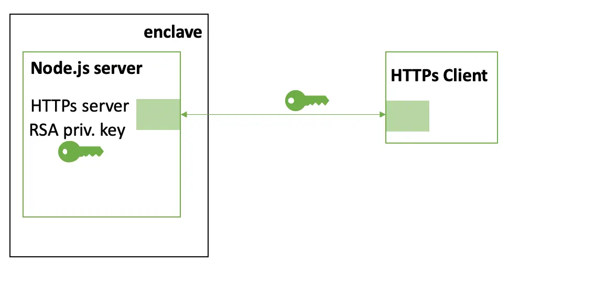

   

<h1 class='h1'>Sigy</h1>

Breaking Intel SGX Enclaves with Malicious Exceptions & Signals   (<a href=''>Asia CCS 2025</a>)

  

    

      <a class="btn btn-primary btn-cta rounded-pill btn-lg head-button" href="/sigy/sigy_asiaccs25.pdf" role="button">Paper</a>
    

  

    

      <a class="btn btn-primary btn-cta rounded-pill btn-lg head-button" href="https://github.com/ahoi-attacks/sigy" role="button">Source</a>
    

  

    

      <a class="btn btn-primary btn-cta rounded-pill btn-lg head-button" href="#cve" role="button">CVE</a>
    

 

## How Does It Work?
Intel SGX provides a user-level abstraction called enclaves to protect sensitive data and code execution. In the SGX threat model, the operating system (OS) is untrusted and programs that were written for the traditional model with a trusted OS cannot run inside the enclaves (e.g., [`syscall`](https://www.felixcloutier.com/x86/syscall) instruction is illegal inside the enclave). So, programmers can either rewrite applications to run in the enclave using a small trusted runtime, or use lift-and-shift solutions that deploy a trusted library OS to bridge the gap. 

In the SGX, the untrusted OS is still responsible for enclave management (like process management) including the signal delivery. Further, SGX runtimes and library OSes which interface with the OS typically support signal delivery to the enclaves. We show that a malicious OS can send fake signals and trick the enclaves into arbitrarily executing signal handlers that have  [global effects](/blog/ahoi-overview/#exploiting-global-effects-of-handlers). 

Let us look at an example: 

The program below computes the `mean` based on the input `data` and handles an `sigfpe`. If there was an exception (e.g., overflow) during the computation, the function discards the new data and reverts the mean back to the old mean. An attacker (malicious OS) can inject `sigfpe` when this program runs to force the program to always execute the exception handling logic even when the data was valid. By doing this, the OS manages to trick the enclave into never updating the mean, thus  compromising its integrity. 

Usually, the OS injects `sigfpe` to processes if the hardware notifies if of a hardware exception (e.g., divide-by-zero, overflow). Apart from signals like `sigfpe` which are directly linked to hardware exceptions, the OS also supports inter-process exceptions (e.g., `sighup`, `sigusr1`). We show that the OS can also compromise SGX enclaves using these signals. 

## Case Studies

### Nginx

By default, Nginx allows a system administrator to upgrade its configuration (C1, C2 in the animation) and binaries (B1, B2 in the animation) using signals (`sighup` and `sigusr1`) without degrading the uptime of the server. We use a malicious OS to inject these signals to an Nginx server executing inside an SGX enclave. This forces the enclave to rollback the configuration (time t5) and binary (time t7) after an administrator has upgraded it. This exploit will undo any performance and security improvements provided by the new binary and configuration and can be used by the OS to bring back old security bugs.

### Node.js
Node.js starts a debug web socket when it receives `sigusr1`. We inject  `sigusr1` from the malicious OS, and force a Node.js HTTPs server executing inside an SGX enclave to open a debug socket. We connect to this socket using Google Chrome’s debugger and leak the RSA private keys used for TLS in HTTPs. 

### Multi-Normal Distribution
JSAT, a statistical analysis tool for machine learning applications, implements a `MultiVariateNormal` class that can be used to create a Multivariate Gaussian distribution. 
The class implements a function that updates the mean and covariance of the distribution using the `setUsingData` function. Like in our first example, this function discards any data that causes an `ArithmeticException`. Java runtime converts all `sigfpe` from the OS to an `ArithmeticException`. We train a Learning Vector Quantization (LVQ) with Multivariate Gaussian distribution as a local classifier in an SGX enclave. Using the malicious OS, we inject `sigfpe` 240 times to drop the error rate of the classifier from 0% to 66%. 

## Analysis
We analysed 8 runtimes (Intel SGX SDK, Open Enclave, Teaclave SGX-SDK, Asylo, Rust EDP, GoTEE, Enarx, and EGo) and 6 library OSes (Gramine, Scone, EnclaveOS, EdgelessRT, MystikOS, and Occlum). We find that 3/8 runtimes (Open Enclave, Teaclave SGX-SDK, and Asylo) and 4/6 library OSes (Gramine, Scone, EnclaveOS, and Occlum) are susceptible to Sigy because they do not detect the fake signals injected by the OS.

We analyzed the signal delivery mechanism and handlers for programs written in 9 languages (C, C++, Java, Python, Go, JavaScript, Rust, Julia and Wasm) to observe their behavior in enclaves. Of the
9 languages we study, 8 (C, C++, Java, Python, Go, JavaScript, Rust, and Julia) offer language constructs for programs to register custom handlers.

So, programs written in any of these languages that have signals developed when executed in one of the 7 vulnerable runtime/library OSes might be vulnerable to Sigy. 

## Affected Software
All Intel SGX enclaves that execute with one of our 7 affected runtimes or library OSes (Open Enclave, Teaclave SGX-SDK, Asylo, Gramine, Scone, EnclaveOS, and Occlum). 

## FAQ


- Yes, Sigy affects all versions of SGX, if the enclaves run in one of the 7 affected runtime or library OSes. 
  




- We analysed 14 runtimes and library OSes to find the 7 that are vulnerable to Sigy. If you use one of the 7 runtimes or library OSes that we analysed and found not vulnerable to Sigy, then you are not affected. If we did not analyse your runtime or library OS, we strongly recommend that you check if it supports signal handling and if it exposes interfaces  to the malicious OS to propagate signals to enclaves. If yes, then the runtime or library OS is vulnerable to Sigy. 
  




- If you are using Gramine, then Sigy is patched in commit [a390e33](https://github.com/gramineproject/gramine/commit/a390e33e16ed374a40de2344562a937f289be2e1). For other runtimes and library OSes, you can check with the respective vendors for a fix. 
- Alternatively, if your enclave application was written in one of the 8 programming languages that offer signal handling constructs, you can analyse the application to check if there are vulnerable handlers that have [global effects](/blog/ahoi-overview/#exploiting-global-effects-of-handlers). Then, if possible, rewrite the signal handlers to mitigate Sigy. 





- Sigy uses signals that are a result of hardware exceptions (e.g., `sigfpe`) and other inter-process signals (e.g., `sighup`, `sigusr1`) to compromise enclaves. SGX2 adds hardware support to store exit information about hardware exceptions in the enclave’s protected state save area (SSA). Runtimes and library OSes should be modified to always check this information before propagating the signals due to hardware exceptions to the enclave. 
- For inter-process signals, runtimes and library OSes that support multi-process enclaves should build a message-passing framework to allow trusted processes in the same enclave to send signal information to each other. If, for functionality, the enclaves require a signal from outside the enclave processes (e.g., administrators in Nginx or Node.js), there is no defense against Sigy.  




- No. Sigy is not a side-channel attack. 



- Sigy abuses signals, a notification mechanism, to compromise SGX enclaves making it an Ahoi attack. 



- Sigy is a wordplay on "signal," which we use to compromise SGX enclaves. 


## Authors
- [Supraja Sridhara](https://suprajas.com/)
- [Andrin Bertschi](https://abertschi.ch/)
- [Benedict Schlüter](https://benschlueter.com/)
- [Shweta Shinde](https://shwetashinde.com)

## Responsible Disclosure
We informed all the 7 impacted runtimes and library OSes from September 2023 to January 2024. All the vendors of the runtimes and library OSes acknowledged that this is an issue. 

## CVE
Sigy is tracked under the following CVEs:
- [CVE-2024-2537](https://cve.mitre.org/cgi-bin/cvename.cgi?name=CVE-2024-2537)
- [CVE-2024-29971](https://cve.mitre.org/cgi-bin/cvename.cgi?name=CVE-2024-29971)
- [CVE-2024-29970](https://cve.mitre.org/cgi-bin/cvename.cgi?name=CVE-2024-29970)

## Acknowledgments
Thanks to the developers of Gramine, Scone, Open Enclave, Teaclave, Asylo, Occlum, and EnclaveOS for their discussion and engagement during the disclosure process.