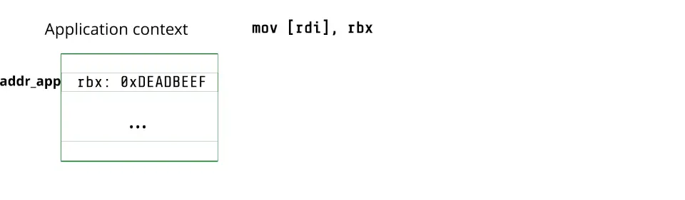

<div class='text-center' style='padding-bottom: 1rem;'>
<div>
   
   <!--  -->
</div>
<h1 class='h1'>WeSee</h1>
<p class="lead">Using Malicious #VC Interrupts to Break AMD SEV-SNP (to appear at <a href='https://sp2024.ieee-security.org/'>IEEE S&P 2024</a>)</p>
<div class="row justify-content-center">
  <div class="col-lg-5 col-sm-6  text-center" style="margin-top: 1.2rem">
    <div class="d-flex flex-column flex-sm-row w-100 text-center">
      <a class="btn btn-primary btn-cta rounded-pill btn-lg head-button" href="/wesee/wesee_oakland24.pdf" role="button">Paper</a>
    </div>
  </div>
<div class="col-lg-5 col-sm-6  " style="margin-top: 1.2rem">
    <div class="d-flex flex-column flex-sm-row" >
      <a class="btn btn-primary btn-cta rounded-pill btn-lg head-button" href="hhttps://github.com/ahoi-attacks/WeSee" role="button">Source</a>
    </div>
  </div>
<div class="col-lg-5 col-sm-6  " style="margin-top: 1.2rem">
    <div class="d-flex flex-column flex-sm-row" >
      <a class="btn btn-primary btn-cta rounded-pill btn-lg head-button" href="#cve" role="button">CVE</a>
    </div>
 </div>
</div>
</div>

## How Does It Work?
AMD SEV-SNP enables the creation of Confidential VMs (CVMs). This setting assumes a malicious hypervisor that cannot directly access the CVM’s memory. In a non-confidential setting, the hypervisor performs different operations (e.g., service hypercalls) that are important for the functionality of the applications. To support this functionality in the presence of a malicious hypervisor, AMD SEV introduces a new VMM Communication exception (#VC). 

**#VC without an attacker:** 
Let’s first look at how #VC is handled during a benign execution. The trusted hardware raises #VC when the CVM executes certain operations (e.g., [`vmmcall`](https://www.felixcloutier.com/x86/vmcall)) as shown in the Animation below. The trusted hardware also stores the information about the operation that caused the #VC in the `exit_reason` register. The trusted guest Linux kernel in the CVM registers a handler for #VC. This handler reads the `exit_reason` and copies the necessary memory and register values into an unprotected shared memory region called the Guest Hypervisor Communication Block (GHCB) as shown in the Animation above. Then, the handler transfers the execution to the hypervisor. Once the hypervisor returns, the #VC handler copies data and register values back to the application context. 


WeSee abuses the #VC handler in the kernel to compromise the CVM with 2 main observations: (a) the hypervisor can arbitrarily raise #VC to the CVM by injecting interrupt number 29 and (b) the hypervisor can control the value in the `exit_reason` register. We illustrate the hypervisor capabilities to compromise the security of the CVM with the example below. 

### Bypass Authentication with WeSee
 Let's consider an application that writes an application key `key_app` into `rax` and then uses the value in `rax` to authenticate a user who enters an input key (`k_in`).
 ```python
 rax = key_app
if rax == k_in: 
	auth
else: 
	fail
 ``` 
A malicious hypervisor without the right key can use WeSee to trick the victim application and authenticate successfully. Specifically, in the Code above, the hypervisor uses WeSee to change `rax` to a key that it controls (`key_hyp`). Then the application would inadvertently compare `k_in` with `k_hyp` to check if a user is authenticated. Because the hypervisor now controls both `k_in` and `k_hyp` it can authenticate successfully. 


In the Animation above, the hypervisor injects #VC with `vmmcall` as the `exit_reason`. This causes the #VC handler to first leak the value in the application’s `rax` (i.e., `key_app`) and then to write a hypervisor-controlled value into the application’s `rax` (i.e., `key_hyp`). Therefore, when the control returns back to the application, the value in `rax` is changed to `key_hyp` and the hypervisor authentication successfully. 

## WeSee Primitives
The hypervisor can set `exit_reason` register to any value of the 16 possible options. In WeSee we only use three: `vmmcall`, `mmio_read`, and `mmio_write`, and they are sufficient to construct powerful primitives. 

### Skip Instructions
First, we construct a primitive to skip arbitrary instructions while the kernel executes. We observe that the #VC handler increments the instruction pointer `rip` once the #VC is successfully handled. Therefore, by chaining #VCs we can skip any number of instructions. We ensure that the #VC execution does not have any undesirable side effects (e.g., change in register values). Therefore, we use `exit_reason = vmmcall` which does not have any undesirable side effects—it only reads `rax` and writes a hypervisor-controlled value to `rax`.

### Read and Write to `rax`
Next, we build primitives to read and write to `rax` using `exit_reason=vmmcall`. As shown in our example attack, on `vmmcall` the #VC handler leaks the value of `rax` to the hypervisor. Then, it writes a hypervisor-controlled value into `rax` when the control returns. Furthermore, this does not have any other undesirable side effects. Therefore, we use the hypervisor to inject #VC with `exit_reason=vmmcall` to build our primitives. 

### Read Kernel Memory
To successfully read any kernel memory of the hypervisor’s choosing, the hypervisor needs 2 capabilities: (a) be able to control a pointer to kernel memory, and (b) this pointer is  dereferenced and copied to the GHCB. 

*#VC handling for MMIO write:* We observe that the hypervisor can gain these capabilities by abusing the `mmio_write` case in the #VC handler. Specifically, on a legitimate MMIO write from the application (e.g., `mov [rdi], rbx`), the hypervisor needs the value stored in the application’s context to write into the MMIO region (e.g., value in `rbx`). Therefore, the #VC handler first invokes a function `get_ptr` to get a pointer to the application’s register as shown in the Animation below.  Note that, `get_ptr` returns the pointer in the `rax` register. Then, the #VC handler dereferences the value in the rax register and copies it into the GHCB. Thus, during normal operation, The hypervisor can use the value in the GHCB to write to the MMIO region. 


Next, we look at how the hypervisor controls the address for the memory read. 

*Attack using MMIO write handling:* The hypervisor starts with the #VC exception with `exit_reason=mmio_write` as shown in the Animation below. Then, to gain control of the pointer, the hypervisor uses the read `rax` primitive when the `get_ptr` function returns. At this point, the hypervisor can write any address into the `rax` register. The #VC handler dereferences the `rax` as a pointer and writes the value into the GHCB leaking kernel memory values. For this attack to succeed, it is crucial for the hypervisor to eliminate undesirable side-effects (e.g., checks that lead to `fail` blocks). For a complete explanation check out our [paper](https://ahoi-attacks.github.io/wesee/wesee_oakland24.pdf).


### Write to Kernel Memory
Like the read memory primitive, the hypervisor can use `exit_reason=mmio_read` which reads a value from GHCB and writes it into the application’s context to arbitrarily write to kernel memory. We show the sequence of #VC injections and its effects in the Animation below. 


### Arbitrary Code Injection
To inject code to be executed in the kernel, we need to write to the `.text` section. By default, the kernel sets up its page tables such that the `.text` section is executable but not writable. To get around this constraint, we first use our read and write memory primitives to change the permissions in the kernel page tables. Specifically, we locate the page tables in kernel memory and then use the read memory primitive to perform a page table walk and the write memory primitive to edit the page permissions. Once all the permissions are changed, our target page is writable. 
Finally, we can write shell code using a chain of write memory primitives to the target page.  

## Case Studies
We demonstrate the expressive power of WeSee with three end-to-end case studies. 
We leak kernel TLS session keys for NGINX with the arbitrary read.  We use arbitrary write and code injection primitives to disable firewall rules and open a root shell. Next, we explain how we gain the root shell.

### Gain a Root Shell 
We demonstrate WeSee by injecting and executing arbitrary code in the guest Linux kernel. 
The kernel exposes an API for kernel modules called `call_usermodehelper`. This API allows kernel modules to start a user space application from the kernel context. When invoked by a kernel module with an executable as an argument, it starts a process with the executable. Note that, this new process is started with root privileges. To attack a victim VM and gain a root shell, we can execute `call_usermodehelper` with 

``` /bin/bash -c rm /tmp/t; mknod /tmp/t p; /bin/sh 0</tmp/t \| nc -ln 8001 1>/tmp/t```

This command spawns a root shell that takes as input all network data from port 8001. 

We inject our shell code into the Linux kernel’s function that receives and handles ICMP packets (`icmp_rcv`). To trigger this function, we send an ICMP packet to the SEV VM. When the shell code calls the `call_usermodehelper` API, it creates a new process with root privileges that provides a root shell that listens on port 8001. Then, to interact with the spawned shell we connect to the VM from the hypervisor using `netcat`. We inject a total of 2891 #VCs to perform the page walk and inject 392 bytes of shell code. See the video below for a demo! 

<iframe width="560" height="315" src="https://www.youtube-nocookie.com/embed/d5kdH-trg9o?si=cjyTu2Za81VnNmQ8" title="YouTube video player" frameborder="0" allow="accelerometer; autoplay; clipboard-write; encrypted-media; gyroscope; picture-in-picture; web-share" referrerpolicy="strict-origin-when-cross-origin" allowfullscreen></iframe>

In summary, a malicious hypervisor can use WeSee to compromise SEV-SNP VMs and gain root access. For more details on our attacks check out our [paper]([link](https://ahoi-attacks.github.io/wesee/wesee_oakland24.pdf)) and [code](https://github.com/ahoi-attacks/WeSee). 

## Affected Hardware and Software
All SEV-SNP processors are vulnerable to WeSee. There is a hotfix in the Linux kernel that mitigates our case study attacks. See FAQs for more information.

## FAQs

  - No. WeSee assumes a malicious hypervisor to inject interrupts. For on-confidential cloud VMs, the hypervisor is implicitly trusted and will not attack the VMs.  The hypervisor also prevents other malicious co-tenant VMs from injecting interrupts into the victim VM by checking and filtering interrupt injections. 


 
  - Upgrade the [Linux kernel](https://lore.kernel.org/lkml/20240311151909.GAZe8g7SqDKRcP4XrO@fat_crate.local/) and use [hardware features](https://www.amd.com/content/dam/amd/en/documents/epyc-business-docs/solution-briefs/amd-secure-encrypted-virtualization-solution-brief.pdf). 
  - Unfortunately, as of 4th April 2024, there is no software support to use this hardware feature in neither mainline Linux nor AMD prototype.



  - No. WeSee is not a side-channel attack.



  - WeSee uses interrupts, a notification mechanism, to compromise AMD SEV-SNP VMs making it an Ahoi attack. 



  - WeSee is a word-play on the VC exception.
  


<!-- 
 -->

### Authors
- [Benedict Schlüter](https://benschlueter.com/)
- [Supraja Sridhara](https://suprajas.com/)
- [Andrin Bertschi](https://abertschi.ch/)
- [Shweta Shinde](https://shwetashinde.com)
### Responsible Disclosure

### CVE

WeSee is tracked under [CVE-2024-25742](https://cve.mitre.org/cgi-bin/cvename.cgi?name=CVE-2024-25742).

### Acknowledgments

